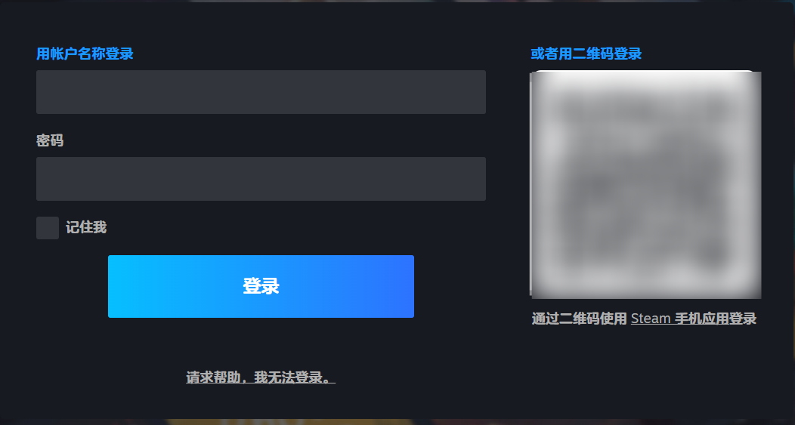
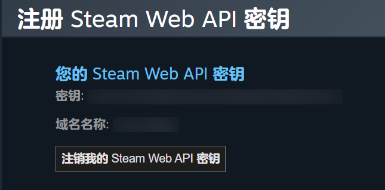

# 如何获取 Steam Web API 密钥 (Steam Web API Key)

本指南将引导您完成获取 Steam Web API 密钥的全部步骤。这个密钥是本程序用来从 Steam 服务器获取您账号的公开信息（如昵称、封禁状态等）所必需的。

## 前提条件

1.  **拥有一个 Steam 账号**。
2.  该 Steam 账号必须**已消费至少 5 美元**（或等值当地货币）。这是 Steam 为了防止机器人滥用而设置的官方限制。新账号需要通过购买游戏或市场交易来解除此限制。

---

## 获取步骤

### 第一步：访问官方 API 密钥页面

打开您的网页浏览器，点击下面的链接以访问 Steam 官方的 API 密钥注册页面：

**[获取Steam API](https://steamcommunity.com/dev/apikey)**

### 第二步：登录您的 Steam 账号

如果您尚未登录，页面会提示您登录。请输入您的 Steam 用户名和密码。

  

如果您的账号开启了 Steam Guard 保护，您还需要输入来自手机应用或电子邮件的动态验证码。

### 第三步：注册密钥

登录成功后，您将看到一个简单的注册表单。

  

请按照以下说明填写：

1.  **域名 (Domain Name)**：
    *   对于本桌面程序，您无需拥有一个真实的网站。
    *   请在这个输入框中填写 `localhost`。
    *   （瞎j8填就行）

2.  **同意条款**：
    *   勾选下方的复选框，表示您同意 Steam Web API 的使用条款。

3.  **点击“注册” (Register) 按钮**。

### 第四步：复制您的密钥

点击“注册”后，页面将刷新并显示您新生成的 API 密钥。

  

*   **密钥 (Key)**：这是一长串由 32 个字母和数字组成的字符串。这就是您需要的 API 密钥。
*   **复制**：选中这整串密钥，然后右键点击选择“复制”，或使用快捷键 `Ctrl + C`。

---

## 如何在程序中使用

1.  打开 **Steam 账号管理器**。
2.  将您刚刚复制的 32 位密钥，粘贴到程序主界面的 **"Steam Web API Key:"** 输入框中。
3.  程序会在您关闭时**自动保存**这个密钥，您无需进行任何额外操作。下次启动时，它会自动加载。

---

## ⚠️ 重要注意事项

*   **请务必保密！** 您的 API 密钥是私密信息，请勿与任何人分享，也不要将其上传到任何公共网站（如 GitHub、论坛等）。
*   **吊销与重置**：如果您怀疑您的密钥已泄露，可以随时返回 [API 密钥页面](https://steamcommunity.com/dev/apikey) 吊销旧密钥并生成一个新密钥。
